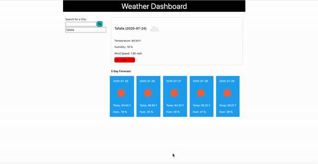

# WeatherDash_Mikel

## Link
[Live Site](https://mikeltafalla.github.io/WeatherDash_Mikel/)

# Table of Contents

* [Technologies](#technologies)
* [Features](#features)
* [Instructions](#instructions)
* [Example Gif](#example-gif)
* [Author](#author)

### Technologies
1. HTML, CSS, JS
2. Jquery
3. Bootstrap framework
4. OpenWeatherMaps API used to retrieve weather info

### Features

1. On load you'll be given any saved city that you've looked for before and the Display where the weather inforamtion will appear
2. Input box to look up fo new cities
3. Searched cities are clickable as well
4. Weather will be given:
    * Main box, Current weather (day /Year-Month-day / , icon of the weather, temp, humidty, WindSpeed, UV index)
    * Below main box there's a 5 day forecast
5. UV Index is color coded

### Instructions

1. Enter de name of the city that you are looking for
2. Current weather and 5 day forecast will appear and city will be saved on searched cities
3. Click any of the saved cities on the list and they'll display the weather as well.

## Example Gif

## Author 

**MikelTafalla**

Email: mikel362d@gmail.com

Location: Santa Barbara

GitHub: https://github.com/MikelTafalla

